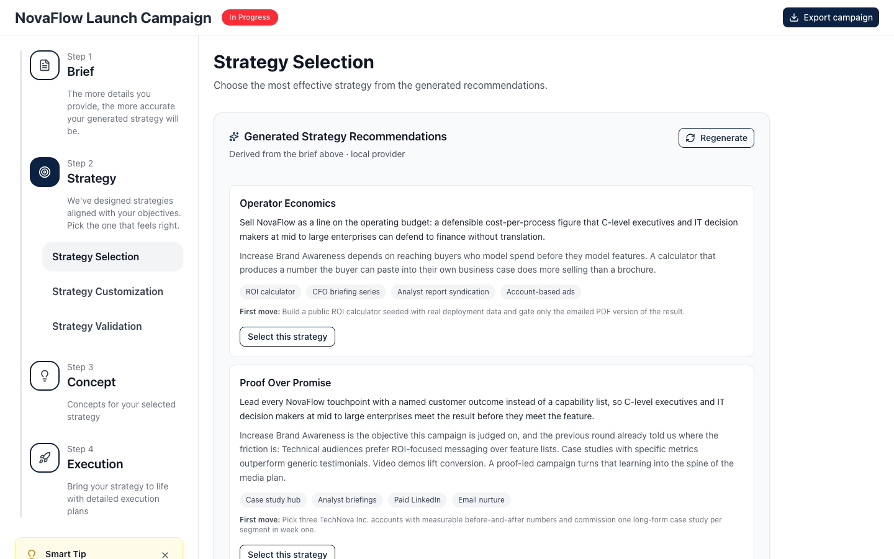
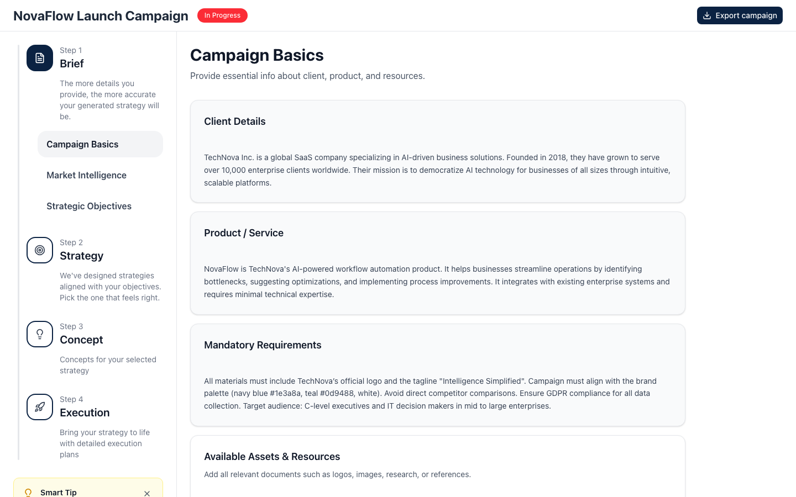
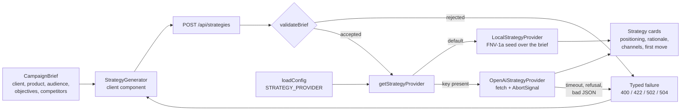
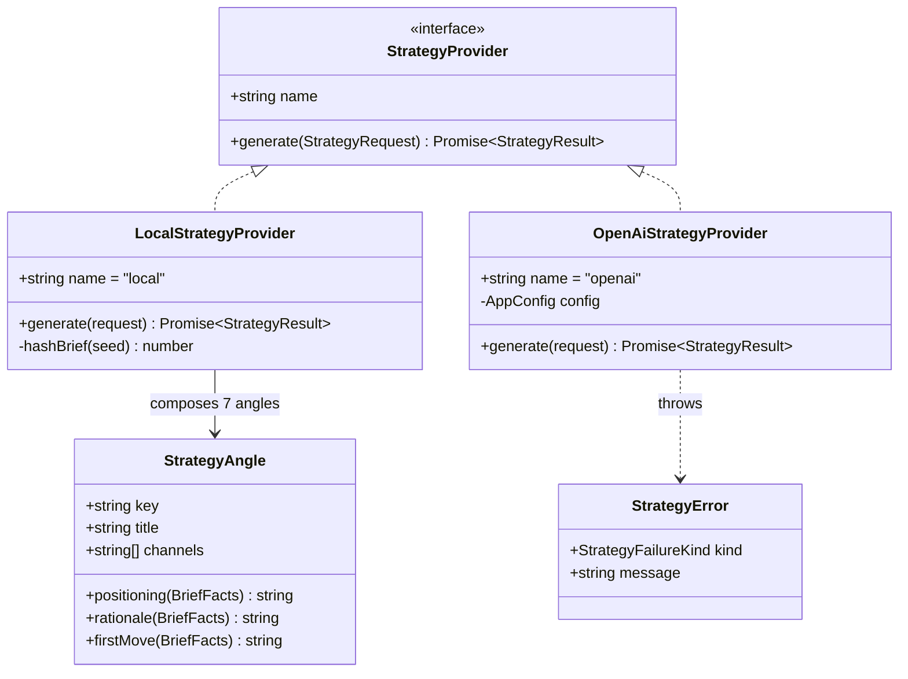

# Campaign Strategy Workspace

A single-page workspace that walks a marketing campaign from a written brief to a
chosen strategy: four steps, twelve sections, and a generator that turns the brief
into strategy recommendations you can actually read.

The repository is named after the assessment it was built for. What it contains is a
campaign planning tool — there is no landing page here.



Every strategy on that screen was produced from the brief in the first step. No API
key was involved: the default generator is deterministic and runs locally, so a fresh
clone shows the same three recommendations you see above.

```bash
npm install
npm run dev     # http://localhost:3000
```

---

## The four steps a campaign moves through

The workflow is declared once, in `lib/workflow/steps.ts`, as four steps of three
sections each:

| Step | Sections |
|---|---|
| 1 — Brief | Campaign Basics · Market Intelligence · Strategic Objectives |
| 2 — Strategy | Strategy Selection · Strategy Customization · Strategy Validation |
| 3 — Concept | Concept Generation · Concept Refinement · Concept Finalization |
| 4 — Execution | Execution Planning · Resource Allocation · Timeline Management |

That array is the only place a section is defined. The sidebar, the page heading, the
Back/Next buttons, the progress fill and the content map all read from it, and
`lib/workflow/navigation.ts` provides the derived views — `SECTION_ORDER`,
`nextSection`, `previousSection`, `completionPercent`, `isStepComplete`. Adding a
thirteenth section is an edit to one file plus one entry in the content map.

The current section lives in the URL as `?section=`, so
`/?section=strategy-selection` is a link you can send to someone, and a reload does
not drop you back on step one. Anything unrecognised in that parameter resolves to
the first section rather than rendering an empty page.



Section content is data, not markup. `lib/content/sections.ts` builds a list of typed
blocks — `prose`, `definition-list`, `numbered-points`, `metric-groups`,
`key-values`, `checklist`, `interactive` — from the `CampaignBrief` object, and
`ContentRenderer` maps block kinds onto components. Nothing in that path renders HTML
from data: every string arrives as a React text child, so brief text cannot become an
injection sink.

---

## Where the strategy text comes from



`LocalStrategyProvider` is the default. It holds a catalogue of seven planning angles
in `lib/strategy/angles.ts` — Proof Over Promise, Category Redefinition, Time To First
Value, Practitioner Advocacy, Risk Reversal, Ecosystem Adjacency, Operator Economics.
Each angle is a set of small functions over `BriefFacts`, so the sentences it produces
name the actual client, product, audience, lead competitor and first objective from
the brief instead of reading as filler.

Which angles come back is decided by an FNV-1a hash of the brief's own text. Same
brief, same three strategies, every time — which is what makes the suite assertable
and the screenshot above reproducible. Change the client and the product and a
different set comes back.

The provider runs inside the route handler, never in the browser. There is no
`NEXT_PUBLIC_*` variable anywhere in this repository and no key reaches the client
bundle.

---

## Swapping the generator for a hosted model



Both implementations satisfy one interface, and `getStrategyProvider` picks between
them from configuration alone. Copy `.env.example` to `.env.local` and set:

| Variable | Default | Meaning |
|---|---|---|
| `STRATEGY_PROVIDER` | `local` | `local` or `openai` |
| `STRATEGY_API_KEY` | — | Required before `openai` is honoured |
| `STRATEGY_MODEL` | `gpt-4o-mini` | Model id sent to the endpoint |
| `STRATEGY_BASE_URL` | `https://api.openai.com/v1` | Any OpenAI-compatible `/chat/completions` host |
| `STRATEGY_TIMEOUT_MS` | `20000` | Abort budget for the upstream call |

Asking for `openai` without a key silently resolves back to `local` rather than
throwing at import time, so a misconfigured deployment degrades to a working app.
`GET /api/health` reports which provider actually resolved.

The hosted path treats these as distinct outcomes rather than one generic error:

- **timeout** — the `AbortSignal` fired; answered as `504`.
- **refused** — a refusal message, a `content_filter` finish reason, or empty
  content; answered as `422`, and the UI says "The model declined this brief".
- **upstream_error** — a non-2xx response or an unreachable host; `502`.
- **unparseable** — valid HTTP, invalid JSON, or JSON with no usable strategies;
  `502`.

---

## What the API answers

**`POST /api/strategies`**

```bash
curl -s -X POST http://localhost:3000/api/strategies \
  -H 'content-type: application/json' \
  -d '{"brief":{"client":"TechNova Inc.","product":"NovaFlow","audience":"IT decision makers"},"count":3}'
```

Answers `{"provider":"local","strategies":[{ "id", "title", "positioning",
"rationale", "channels", "firstMove" }]}`.

`validateBrief` narrows the untrusted body before a provider sees it: `client`,
`product` and `audience` are required and non-blank, every text field is capped at
4 000 characters so the request cannot be used to inflate a prompt, and malformed
entries inside `competitors`, `objectives`, `kpis` and `successMetrics` are dropped
rather than trusted. `count` is clamped to 1–5 regardless of what the client asks
for. A local answer is sent with `cache-control: private, max-age=60`; a hosted one
is `no-store`.

**`GET /api/health`** returns `{"status":"ok","strategyProvider":"local","sections":12}`.

---

## Attaching documents

Upload validation lives in `lib/uploads/validate.ts` as a pure function over
`{ name, size, type }`, which is why it is exercised by fourteen assertions without a
browser. The rules:

- Accepted formats are `.pdf`, `.xlsx`, `.docx`, `.doc`. The **extension** is
  authoritative and the MIME type is a secondary check — `file.type` is
  browser-supplied, and an empty string is normal for `.docx` on some platforms, so
  only an actively contradictory content type is a rejection.
- 5 MB per file, 10 files per collection, zero-byte files rejected.
- A file already attached (same name and size) is rejected as a duplicate, including
  within a single drop.
- **Each file is judged on its own.** One bad file in a drag of ten no longer
  discards the other nine — the valid ones are attached and the rejections are
  reported with a reason each.

Only metadata is kept. Nothing in the app reads the bytes, so holding `File` handles
in React state would pin whole documents in memory for no benefit and would make
every object containing them unserialisable.

---

## Personas and the export


Five seed personas ship in `lib/personas/defaults.ts`, each with real demographic,
behavioural and psychographic text, so opening one for editing shows a populated
form. Saving a persona updates it in place by id and selects it; removing one drops
it from the audience selection too.

Because personas carry document *metadata* rather than `File` objects, the whole
workspace serialises. **Export campaign** in the header downloads the brief, the
selected audiences, the chosen strategy, the attachment list and the completed
sections as one JSON file.

---

## Tests

```bash
npm test          # vitest run
npm run typecheck # tsc --noEmit
npm run lint      # eslint
```

`npm test` — **88 passed, 0 failed** across 10 files. The suite is Vitest with jsdom,
and it needs no network and no key because the default provider is deterministic.

| File | Covers |
|---|---|
| `tests/workflow.test.ts` | Step/section integrity, forward and backward walks, clamping at both ends, junk query values, progress that cannot exceed 100% |
| `tests/uploads.test.ts` | Every validation rule, mixed selections, duplicates, the collection cap |
| `tests/strategy-local.test.ts` | Determinism, angle uniqueness, grounding in the brief, no unreplaced template slots |
| `tests/strategy-openai.test.ts` | Refusal, content filter, timeout, non-2xx, unparseable JSON, and that the key appears only in the `Authorization` header |
| `tests/brief-validate.test.ts` | Required fields, the length cap, malformed array entries |
| `tests/api-strategies.test.ts` | Both route handlers, called directly |
| `tests/content.test.ts` | Every section has content and reflects the brief |
| `tests/export.test.ts` | JSON round-trip, persona invariants |
| `tests/FileUpload.test.tsx` | Rendering, drops, rejection messages, input reset |
| `tests/StrategyGenerator.test.tsx` | Mount-time generation, refusal wording, retry, selection |

---

## Container image

```bash
docker compose up --build   # http://localhost:3000
```

Three stages: `npm ci`, `next build`, then a runtime stage that copies only
`.next/standalone`, `.next/static` and `public`. It runs as the image's unprivileged
`node` user, the compose service mounts the filesystem read-only with a tmpfs for
`/tmp`, and the healthcheck polls `/api/health`.

`docker compose config` parses. **The image has not been built or booted** — Docker
was unavailable on the machine this was prepared on, so treat the build itself as
unverified.

An earlier `netlify.toml` in this repository pinned `@netlify/next-runtime`, a
package whose newest published version is `5.0.0-alpha.25` and which has been
superseded by `@netlify/plugin-nextjs`. Rather than leave a deploy config that points
at an abandoned alpha, it was removed in favour of the container path above.

---

## What this is not

- **The brief is a fixture.** `lib/brief/sample.ts` holds one demo campaign and there
  is no UI for editing it or creating a second one. Every section renders from that
  object, and the API accepts any brief, but the app itself ships with one.
- **Nothing persists.** State is React state. A reload keeps your section, because
  that is in the URL, and loses your personas, attachments and selection.
- **Uploaded documents are never read.** They are listed, validated and exported as
  metadata. They do not reach the generator.
- **Steps 3 and 4 are structure, not product.** Concept and Execution render briefing
  prose and planning checklists derived from the brief. There is no concept generator
  behind them.
- **No auth.** Both endpoints are open. The app holds no user data to protect, but an
  unauthenticated `POST /api/strategies` against a configured hosted provider is a
  way to spend someone else's tokens — put it behind auth and a rate limit before
  exposing it with `STRATEGY_PROVIDER=openai`.

---

## Layout

```
app/api/strategies/route.ts   validation, provider dispatch, status mapping
app/api/health/route.ts       liveness + resolved provider
components/StrategyApp.tsx    orchestration and URL-backed section state
components/StrategyGenerator.tsx   loading, refusal, retry, selection
components/ContentRenderer.tsx     block kind -> component (blocks/ holds them)
lib/workflow/                 steps.ts (source of truth) + navigation.ts
lib/content/                  block types and the brief -> blocks map
lib/brief/                    CampaignBrief, the sample, request validation
lib/strategy/                 provider interface, local + hosted, 7 angles
lib/uploads/                  constraints and the pure validator
lib/personas/                 Persona type, seed data, factories
tests/                        10 suites
```

Built with Next.js 16 (App Router), React 19, TypeScript, Tailwind CSS 4 and
shadcn/ui, with 11 `components/ui` primitives.
